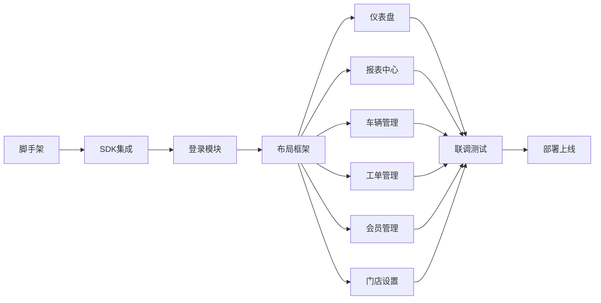
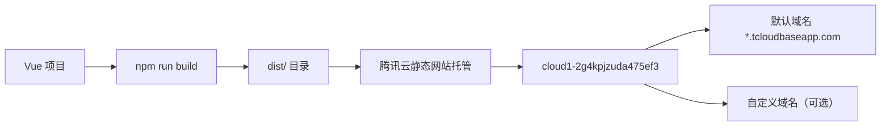

# AI养车 Plus — v6.3.0 Web 端 PC 管理后台开发文档

> 版本：v6.3.0 | 分支：feature/web-pc | 创建日期：2026-05-16 | 状态：开发中
>
> **前置依赖**：feature/inventory-management 合回 master 后启动开发

---

## 一、项目概述

### 1.1 背景

爱养车 Plus 目前仅提供微信小程序端，门店管理员/员工在手机上操作。Web 端（PC 管理后台）旨在解决以下痛点：

- **大屏操作**：管理员在 PC 浏览器上查看报表、管理数据
- **批量操作**：小程序上长列表翻页不便，PC 端表格操作效率更高
- **多端协同**：老板在电脑上查看经营看板，员工在手机上开单
- **拓展性**：后续可为超级管理员提供多门店管理能力

### 1.2 核心架构决策

| 决策项 | 选择 | 原因 |
|--------|------|------|
| **部署方式** | 腾讯云静态网站托管 | 零服务器成本，自动 HTTPS，CDN 加速 |
| **部署环境** | `cloud1-2g4kpjzuda475ef3`（本小程序按量付费环境） | 用户已将本小程序环境切换为按量计费，可直接开通静态托管 |
| **后端调用** | CloudBase JS SDK 直调资源方云函数 | 无需额外搭建 API 网关，直接复用 `@cloudbase/js-sdk` |
| **数据库访问** | 全走云函数 | Web 端不直接操作数据库，全部通过 `repair_main` 云函数路由调用 |
| **框架** | Vue 3 (Composition API) + Element Plus | 开发效率高，组件生态完善，团队学习成本低 |
| **构建工具** | Vite | 极速冷启动，按需编译，开发体验好 |

### 1.3 架构全景图

```
┌──────────────────────────────────────────────────────────────────┐
│                    用户浏览器 (PC)                                │
│  Vue 3 + Element Plus SPA                                        │
│  ┌───────────┐  ┌───────────┐  ┌───────────┐                    │
│  │ 登录页     │  │ 仪表盘     │  │ 车辆管理   │  ... 页面          │
│  └─────┬─────┘  └─────┬─────┘  └─────┬─────┘                    │
│        └──────────────┼──────────────┘                           │
│                       │ CloudBase JS SDK                         │
│        ┌──────────────┴──────────────┐                           │
│        │  app.callFunction()         │                           │
│        │  匿名登录 + 环境绑定        │                           │
│        └──────────────┬──────────────┘                           │
└───────────────────────┼──────────────────────────────────────────┘
                        │ HTTPS
                        ▼
┌──────────────────────────────────────────────────────────────────┐
│       腾讯云静态网站托管 (cloud1-2g4kpjzuda475ef3)                │
│       dist/ → CDN → HTTPS                                       │
└──────────────────────────────────────────────────────────────────┘
                        │
                        │ CloudBase JS SDK callFunction
                        ▼
┌──────────────────────────────────────────────────────────────────┐
│       资源方云环境 (cloud1-2gwoxtay6a4d8181)                     │
│                                                                  │
│  ☁️ 云函数: repair_main (40 action)                              │
│     - 认证域: getOpenId / loginByPhoneCode / ...                 │
│     - 核心业务: addCar / createOrder / ...                       │
│     - 统计域: getDashboardStats / getReportOrders / ...           │
│     - 列表域: listCars / listOrders / ...                        │
│     - 月报域: generateMonthlyReport / ...                        │
│                                                                  │
│  🗄️ 数据库: repair_orders / repair_cars / repair_members / ...   │
│  📦 存储: 图片/文件                                              │
│                                                                  │
└──────────────────────────────────────────────────────────────────┘
```

---

## 二、环境与配置

### 2.1 云环境清单

| 环境 | 用途 | AppID | 环境 ID | 计费模式 |
|------|------|-------|---------|---------|
| **小程序环境（自身）** | 静态网站托管（部署 Web 静态文件） | `wxdf0d09e0777fdaea` | `cloud1-2g4kpjzuda475ef3` | 按量计费（无基础套餐） |
| **资源方环境** | 云函数 + 数据库 + 存储（数据所在） | `wxb1c736174ede330c` | `cloud1-2gwoxtay6a4d8181` | 按量计费/19.9套餐 |

### 2.2 开通步骤

**第一步：开通静态网站托管**

1. 登录 [云开发控制台](https://console.cloud.tencent.com/tcb)
2. 选择环境：`cloud1-2g4kpjzuda475ef3`（自身环境）
3. 进入「静态网站托管」→ 点击「开始使用」/「开通」
4. 等待 1~3 分钟初始化

**第二步：资源方环境开启匿名登录**

1. 切换控制台环境到 `cloud1-2gwoxtay6a4d8181`（资源方环境）
2. 进入「登录方式」→ 开启 **「匿名登录」**
3. 记录「匿名登录」所需的凭证信息

**第三步：配置安全域名**

1. 资源方环境 →「安全配置」→「Web 安全域名」
2. 添加静态托管域名：`https://<env-id>.service.tcloudbase.com`（开通后可见）
3. 如果使用自定义域名，同时添加自定义域名

### 2.3 费用估算

| 项目 | 费用 | 说明 |
|------|------|------|
| 静态网站托管 | **0 元/月** | 免费额度 5GB 存储 + 5GB CDN 流量，MVP 阶段绰绰有余 |
| CloudBase JS SDK 调用云函数 | **计入资源方环境调用量** | 不额外收费，走资源方环境的免费额度 |
| 资源方环境 | 已有 | 小程序已经在用，费用不变 |
| **合计** | **≈ 0 元/月**（MVP 阶段） | |

超出免费额度后：
- CDN 流量：**0.21 元/GB**
- 存储空间：**0.0043 元/GB/天**（≈ 0.13 元/GB/月）

---

## 三、技术选型

### 3.1 技术栈

| 技术 | 版本 | 用途 |
|------|------|------|
| **Vue 3** | ^3.4 | 前端框架，Composition API |
| **Element Plus** | ^2.8 | UI 组件库（表格/表单/对话框等） |
| **Vite** | ^6.0 | 构建工具 |
| **Vue Router** | ^4.4 | 前端路由 |
| **Pinia** | ^2.2 | 状态管理 |
| **Axios** | ^1.7 | HTTP 请求封装（备用调用方式） |
| **@cloudbase/js-sdk** | ^1.5 | 云函数调用 SDK（主力调用方式） |
| **ECharts** | ^5.5 | 数据可视化图表 |
| **dayjs** | ^1.11 | 日期处理（替代小程序 util.js 日期函数） |

### 3.2 与原方案的关键变更

| 原方案（v1.0） | 新方案（v6.3.0） | 变更原因 |
|---------------|-----------------|---------|
| HTTP API 网关调用云函数 | **CloudBase JS SDK 直调** | 无需维护 access_token，SDK 封装更完善 |
| 新建按量计费环境 | **复用本小程序自身环境** | 用户已切换自身环境为按量计费 |
| `cloudbase` SDK 匿名登录 | 匿名登录 + 业务层账号认证 | 两层认证：SDK 匿名层 + 业务手机号密码层 |
| Axios 主调用 | **JS SDK 主调用，Axios 备用** | JS SDK 更稳定，Axios 作为降级方案 |

---

## 四、项目目录结构

```
aiyangche_plus/
├── miniprogram/              ← 小程序代码（不变）
├── cloudfunctions/           ← 云函数（不变）
├── web-admin/                ← 【新增】Web 端项目
│   ├── public/
│   ├── src/
│   │   ├── api/              ← 后端调用封装
│   │   │   ├── cloud.js          ← CloudBase JS SDK 实例 + 初始化
│   │   │   ├── auth.js           ← 登录/权限 API
│   │   │   ├── dashboard.js      ← 仪表盘 API
│   │   │   ├── car.js            ← 车辆管理 API
│   │   │   ├── order.js          ← 工单管理 API
│   │   │   ├── report.js         ← 报表 API
│   │   │   └── member.js         ← 会员 API
│   │   ├── assets/           ← 静态资源（图片/图标等）
│   │   ├── components/       ← 公共组件
│   │   │   ├── AppLayout.vue     ← 后台布局（侧边栏+顶栏+面包屑）
│   │   │   ├── PlateDisplay.vue  ← 车牌格式化显示
│   │   │   ├── ProBadge.vue      ← Pro 版本标识
│   │   │   └── StatCard.vue      ← 数据统计卡片
│   │   ├── composables/      ← 组合式函数
│   │   │   ├── useAuth.js        ← 登录态/权限管理
│   │   │   ├── useCloudFunc.js   ← 云函数调用封装（统一错误处理）
│   │   │   └── usePagination.js  ← 分页逻辑封装
│   │   ├── router/           ← 路由配置
│   │   │   └── index.js          ← 路由表 + 导航守卫
│   │   ├── stores/           ← Pinia 状态管理
│   │   │   ├── user.js           ← 用户信息/权限/token
│   │   │   └── app.js            ← 全局状态（侧边栏折叠/主题等）
│   │   ├── utils/            ← 工具函数
│   │   │   ├── constants.js      ← 全局常量（同步小程序端）
│   │   │   ├── format.js         ← 格式化函数（金额/日期/车牌/手机号）
│   │   │   └── validate.js       ← 表单校验规则
│   │   ├── views/            ← 页面
│   │   │   ├── login/            ← 登录页
│   │   │   │   └── LoginView.vue
│   │   │   ├── dashboard/        ← 首页看板
│   │   │   │   └── DashboardView.vue
│   │   │   ├── report/           ← 报表中心
│   │   │   │   ├── ReportView.vue
│   │   │   │   └── MonthlyReportView.vue
│   │   │   ├── car/              ← 车辆管理
│   │   │   │   ├── CarListView.vue
│   │   │   │   └── CarDetailView.vue
│   │   │   ├── order/            ← 工单管理
│   │   │   │   ├── OrderListView.vue
│   │   │   │   └── OrderDetailView.vue
│   │   │   ├── member/           ← 会员管理
│   │   │   │   └── MemberListView.vue
│   │   │   └── settings/         ← 设置
│   │   │       └── SettingsView.vue
│   │   ├── styles/           ← 全局样式
│   │   │   └── variables.scss    ← SCSS 变量
│   │   ├── App.vue           ← 根组件
│   │   └── main.js           ← 入口文件
│   ├── index.html
│   ├── vite.config.js
│   ├── package.json
│   ├── .env.development         ← 开发环境变量
│   └── .env.production          ← 生产环境变量
```

---

## 五、核心架构设计

### 5.1 CloudBase JS SDK 初始化与云函数调用

这是 Web 端调用后端云函数的核心通道。

#### 5.1.1 SDK 初始化 (`src/api/cloud.js`)

```javascript
import cloudbase from '@cloudbase/js-sdk'

const RESOURCE_ENV = 'cloud1-2gwoxtay6a4d8181'  // 资源方环境 ID

let app = null
let anonymousAuthed = false

/**
 * 获取 CloudBase 应用实例（单例，懒初始化）
 */
export function getCloudApp() {
  if (!app) {
    app = cloudbase.init({
      env: RESOURCE_ENV
    })
  }
  return app
}

/**
 * 匿名登录（首次调用时执行）
 * Web 端无微信上下文，必须通过匿名登录获得临时身份
 */
export async function ensureAnonymousAuth() {
  if (anonymousAuthed) return
  const cloudApp = getCloudApp()
  const auth = cloudApp.auth()
  await auth.anonymousAuthProvider().signIn()
  anonymousAuthed = true
  console.log('[Cloud] 匿名登录成功')
}

/**
 * 调用云函数（统一封装）
 * @param {string} name - 云函数名，默认 'repair_main'
 * @param {string} action - action 名称
 * @param {object} data - 业务参数
 * @param {object} options - 可选配置 { timeout, showLoading }
 * @returns {Promise<object>}
 */
export async function callCloudFunction({ name = 'repair_main', action, data = {}, options = {} }) {
  // 登录校验
  const userStore = (await import('@/stores/user')).useUserStore()
  const token = userStore.token
  if (!token && action !== 'loginByPhoneCode' && action !== 'getOpenId') {
    throw new Error('未登录，请先登录')
  }

  await ensureAnonymousAuth()

  const cloudApp = getCloudApp()
  const startTime = Date.now()

  try {
    const res = await cloudApp.callFunction({
      name,
      data: {
        action,
        ...data,           // 业务参数
        token,             // Web 端登录令牌
        source: 'web'      // 标记调用来源，便于云函数区分
      }
    })

    const duration = Date.now() - startTime
    console.log(`[Cloud] ${action} 耗时: ${duration}ms`)

    // 统一错误处理
    if (res.code) {
      throw new Error(res.msg || `云函数错误: ${res.code}`)
    }
    return res.result || res.data || {}
  } catch (err) {
    console.error(`[Cloud] ${action} 调用失败:`, err)
    throw err
  }
}
```

#### 5.1.2 对云函数的变动要求

**云函数不需要做任何代码修改**。`repair_main` 已经是 action 路由模式，Web 端传递同样的参数结构即可。

需要注意的兼容点：

| 项目 | 小程序 | Web 端 | 云函数处理 |
|------|--------|--------|-----------|
| openid | 微信自动注入 `context.CLIENTIP.openid` | **无 openid** | 云函数 `source === 'web'` → 通过 token 映射账号 |
| 鉴权 | 自动附带 openid | 手动传递 token/shopPhone | `checkPermission` 使用 shopPhone 鉴权 |
| 调用方式 | `wx.cloud.callFunction` | `cloudApp.callFunction` | 两端参数结构一致，云函数无感知 |

### 5.2 登录鉴权流程

Web 端不依赖微信登录，采用**手机号 + 门店码**登录，复用云函数 `loginByPhoneCode` action。

```
┌──────────┐         ┌──────────────┐         ┌──────────────┐
│ 登录页    │         │ CloudBase    │         │ 云函数        │
│          │         │ 匿名登录     │         │ loginByPhone │
│          │         │              │         │ Code         │
├──────────┤         ├──────────────┤         ├──────────────┤
│ 1. 填写  │         │              │         │              │
│ 手机号+  │────────►│ 2. SDK 匿名  │         │              │
│ 门店码   │         │ 登录         │         │              │
│          │         │              │         │              │
│          │         │ 3. 登录成功  │────────►│ 4. 验证      │
│          │         │ (临时身份)   │         │ 手机号+门店码│
│          │         │              │         │              │
│          │         │              │         │ 5. 验证成功  │
│          │◄────────│ 6. 返回结果  │◄────────│ 返回用户信息 │
│          │         │ (token+信息) │         │ + token      │
│          │         │              │         │              │
│ 7. 写入  │         │              │         │              │
│ localStorage│      │              │         │              │
│ 跳转首页  │         │              │         │              │
└──────────┘         └──────────────┘         └──────────────┘
```

**登录状态存储**：

| 存储项 | Key | 存储方式 | 说明 |
|--------|-----|---------|------|
| 登录令牌 | `web_token` | localStorage | 用于后续云函数调用的身份标识 |
| 用户信息 | `web_user_info` | localStorage | shopPhone/role/phone/name 等 |
| Token 到期 | `web_token_expire` | localStorage | 7 天有效期 |

### 5.3 路由与权限守卫

```javascript
// src/router/index.js

import { createRouter, createWebHistory } from 'vue-router'
import { useUserStore } from '@/stores/user'

const routes = [
  {
    path: '/login',
    name: 'Login',
    component: () => import('@/views/login/LoginView.vue'),
    meta: { requiresAuth: false }
  },
  {
    path: '/',
    component: () => import('@/components/AppLayout.vue'),
    redirect: '/dashboard',
    children: [
      {
        path: 'dashboard',
        name: 'Dashboard',
        component: () => import('@/views/dashboard/DashboardView.vue'),
        meta: { requiresAuth: true, roles: ['admin', 'staff'] }
      },
      {
        path: 'cars',
        name: 'CarList',
        component: () => import('@/views/car/CarListView.vue'),
        meta: { requiresAuth: true, roles: ['admin'] }
      },
      {
        path: 'orders',
        name: 'OrderList',
        component: () => import('@/views/order/OrderListView.vue'),
        meta: { requiresAuth: true, roles: ['admin', 'staff'] }
      },
      {
        path: 'report',
        name: 'Report',
        component: () => import('@/views/report/ReportView.vue'),
        meta: { requiresAuth: true, roles: ['admin'], pro: true }
      },
      {
        path: 'members',
        name: 'MemberList',
        component: () => import('@/views/member/MemberListView.vue'),
        meta: { requiresAuth: true, roles: ['admin'] }
      },
      {
        path: 'settings',
        name: 'Settings',
        component: () => import('@/views/settings/SettingsView.vue'),
        meta: { requiresAuth: true, roles: ['admin'] }
      }
    ]
  }
]

const router = createRouter({
  history: createWebHistory(),
  routes
})

router.beforeEach(async (to, from, next) => {
  const userStore = useUserStore()

  if (to.meta.requiresAuth) {
    // 检查登录态
    if (!userStore.token) {
      return next('/login')
    }

    // 检查角色
    if (to.meta.roles && !to.meta.roles.includes(userStore.role)) {
      return next('/dashboard')  // 无权限跳回首页
    }

    // Web 端员工(staff)权限限制：
    // - 员工只能看 dashboard 和 orderList
    // - 不开放看 report / members / cars / settings 等页面
    if (userStore.role === 'staff' && to.name !== 'Dashboard' && to.name !== 'OrderList') {
      return next('/dashboard')
    }

    // Pro 版检查（某些页面需要 Pro）
    if (to.meta.pro && !userStore.isPro) {
      return next('/dashboard')
    }
  }

  next()
})

export default router
```

### 5.4 权限矩阵（Web 端）

参考小程序端的 `ACTION_PERMISSIONS` + `checkPageAccess`，Web 端做同等约束：

| 页面 | `requiresAuth` | 角色限制 | Pro 限制 | 小程序对应 |
|------|:---:|:---------:|:--------:|:----------:|
| `/login` | ❌ | 无 | 无 | welcome |
| `/dashboard` | ✅ | admin/staff | 无 | dashboard |
| `/report` | ✅ | admin | ✅ Pro | report |
| `/monthly-report` | ✅ | admin | ✅ Pro | monthlyReport |
| `/cars` | ✅ | admin | 无 | carList |
| `/orders` | ✅ | admin/staff | 无 | orderList |
| `/members` | ✅ | admin | 无 | memberList |
| `/settings` | ✅ | admin | 无 | proUnlock |

### 5.5 错误处理与异常兜底

```javascript
// src/composables/useCloudFunc.js

import { ElMessage } from 'element-plus'
import { callCloudFunction } from '@/api/cloud'

export function useCloudFunc() {
  const isLoading = ref(false)

  async function call(action, data = {}, options = {}) {
    const { showLoading = true, timeout = 10000 } = options
    isLoading.value = true

    try {
      const result = await Promise.race([
        callCloudFunction({ action, data }),
        new Promise((_, reject) =>
          setTimeout(() => reject(new Error('请求超时')), timeout)
        )
      ])
      return result
    } catch (err) {
      // 统一错误提示
      const msg = err.message || '请求失败，请稍后重试'

      // 超时错误
      if (msg.includes('超时')) {
        ElMessage.warning('请求超时，请检查网络后重试')
      }
      // 登录过期
      else if (msg.includes('未登录') || msg.includes('token')) {
        ElMessage.error('登录已过期，请重新登录')
        const userStore = (await import('@/stores/user')).useUserStore()
        userStore.logout()
        router.push('/login')
      }
      // 权限错误
      else if (msg.includes('-403') || msg.includes('无权限')) {
        ElMessage.error('无权限执行此操作')
      }
      // 通用错误
      else {
        ElMessage.error(msg)
      }

      throw err
    } finally {
      isLoading.value = false
    }
  }

  return { call, isLoading }
}
```

### 5.6 数据导出方案

Web 端的数据导出优于小程序方案：

| 对比项 | 小程序端 | Web 端 |
|--------|---------|--------|
| 导出方式 | 云函数全量拉取 + SheetJS 客户端生成 | 云函数全量拉取 + SheetJS 浏览器端生成 |
| 文件保存 | `wx.getFileSystemManager().writeFile` + `wx.openDocument` | `URL.createObjectURL` + `<a>` 触发下载 |
| 用户体验 | 需跳转文件预览，体验差 | 浏览器直接下载 Excel 文件 |
| 瓶颈 | 小程序文件系统限制 | 浏览器内存限制（一般 2GB+） |

Web 端数据导出流程：

```
用户点击导出 → 调用 exportData 云函数 → 接收数据(最大5000条)
  → SheetJS 生成 XLSX → Blob → 浏览器下载
```

---

## 六、与小程序代码复用策略

| 模块 | 复用方式 | 备注 |
|------|---------|------|
| `utils/constants.js` | **直接复制**到 `web-admin/src/utils/constants.js` | 纯 JS 常量，零依赖，自动同步 |
| `utils/util.js` 中的纯函数 | **选择性复制**到 Web 端（日期/格式化工具） | 剔除 `wx.*` 依赖的函数 |
| 月报规则引擎 | **直接复制** | `benchmarks.js` / `diagnosisRules.js` / `monthlyReportEngine.js` 均为纯函数 |
| 云函数 `repair_main` | **完全复用，无需修改** | 通过 CloudBase JS SDK 调用，参数格式兼容 |
| 查车单检查项配置 | **直接复制** | `constants.js` 中的 `CHECK_ITEMS` / `CHECK_STATUS` 等配置 |
| 车牌脱敏格式化 | **重写**为 Vue 组件 `PlateDisplay.vue` | 小程序端用 WXS，Web 端用 JS 函数 |

---

## 七、MVVM 页面功能清单

### 7.1 首期 MVP 功能

| # | 模块 | 页面 | 功能描述 | 依赖的云函数 action | 工作量 |
|---|------|------|---------|-------------------|:------:|
| 1 | **登录** | LoginView | 手机号 + 门店码登录，切换账号 | `loginByPhoneCode` | 1.5 天 |
| 2 | **仪表盘** | DashboardView | 今日概况（工单数/营业额/新客/会员），ECharts 折线图 | `getDashboardStats` | 2 天 |
| 3 | **报表中心** | ReportView | 今日/本周/本月/本年四个 Tab，ECharts 柱状图+折线图 | `getReportOrders`, `getCustomerRanking` | 3 天 |
| 4 | **车辆管理** | CarListView | 分页表格，车牌搜索，车辆状态筛选 | `listCars` | 2 天 |
| 5 | **车辆详情** | CarDetailView | 基本信息卡片，历史工单列表，消费统计 | `getCarOrderStats` + 客户端DB | 1 天 |
| 6 | **工单管理** | OrderListView | 分页表格，日期/状态筛选，快速查看 | `listOrders` | 2 天 |
| 7 | **工单详情** | OrderDetailView | 工单信息展示，服务项目列表，备注 | `editOrder`(只读)/`voidOrder`(作废) | 1 天 |
| 8 | **会员管理** | MemberListView | 分页表格，搜索，会员等级筛选 | `listMembers` | 1.5 天 |
| 9 | **门店设置** | SettingsView | 门店基本信息修改，员工列表查看 | `getShopProfile`, `updateShopInfo`, `listStaffs` | 1 天 |

### 7.2 二期迭代功能

| # | 模块 | 优先级 | 说明 |
|---|------|:------:|------|
| 1 | **AI 月报详情页** | P1 | 月度经营诊断报告展示，复用月报规则引擎 |
| 2 | **新增车辆/工单/会员** | P1 | Web 端直接创建而非仅查看 |
| 3 | **数据导出** | P2 | Excel 导出门店数据，优于小程序端体验 |
| 4 | **首页大屏模式** | P2 | 全屏看板，适合门店挂墙大屏展示 |
| 5 | **多门店切换** | P2 | 超级管理员跨门店查看数据 |

### 7.3 Web 端不做（小程序独有）

| 功能 | 原因 |
|------|------|
| 开单编辑（orderAdd） | 复杂交互 > PC 端反而效率低，保留小程序端 |
| 查车单（checkSheet） | 依赖手机摄像头拍照，PC 端无此场景 |
| OCR 识别 | 依赖手机摄像头，PC 端无此能力 |
| 新增会员（memberAdd） | 复杂度低，小程序端即可完成 |
| 隐私/用户协议页 | 小程序审核需要，Web 端可省略 |

---

## 八、开发计划

### 8.1 启动前提

> ⏳ **等待 `feature/inventory-management` 合回 `master` 后启动**

### 8.2 里程碑

| Milestone | 内容 | 预估工时 | 完成标准 |
|-----------|------|:--------:|---------|
| **M1: 脚手架与环境** | Vue 项目初始化 + Vite + Element Plus + 目录结构 | 0.5 天 | `npm run dev` 本地可访问 |
| **M2: SDK 集成** | CloudBase JS SDK 初始化 + 匿名登录 + callFunction 封装 | 0.5 天 | 云函数可被调用并返回数据 |
| **M3: 登录模块** | 登录页 + Pinia store + 路由守卫 + localStorage 持久化 | 1.5 天 | 手机号+门店码登录成功 |
| **M4: 布局框架** | AppLayout（侧边栏 + 顶栏 + 面包屑）+ 路由菜单 | 1 天 | 菜单切换页面正常 |
| **M5: 仪表盘** | 统计卡片 + ECharts 图表 + 今日经营概况 | 2 天 | 数据显示正确 |
| **M6: 报表中心** | 四个 Tab 切换 + 一维分析 + 客户排行 + 收入趋势 | 3 天 | 各 Tab 数据准确 |
| **M7: 车辆管理** | 分页表格 + 搜索 + 状态筛选 + 详情页 | 2 天 | 搜索筛选分页正常工作 |
| **M8: 工单管理** | 分页表格 + 日期筛选 + 详信息页 + 作废操作 | 2 天 | 列表/详情/作废功能完整 |
| **M9: 会员管理** | 分页表格 + 搜索 + 等级筛选 | 1.5 天 | 列表数据准确 |
| **M10: 门店设置** | 基本信息编辑 + 员工列表 | 1 天 | 修改保存生效 |
| **M11: 联调测试** | 全流程测试 + 边界情况 + 错误处理 | 2 天 | 所有 MVP 功能无阻断 Bug |
| **M12: 部署上线** | 打包 → 静态网站托管 → 自定义域名 → HTTPS | 0.5 天 | 公网可访问 |
| **总计** | **MVP 版本** | **~17 天** | |

### 8.3 依赖关系



M5~M10 互相独立，可并行开发。

---

## 九、部署方案

### 9.1 构建打包

```bash
# 构建
cd web-admin
npm run build

# 输出目录
# web-admin/dist/   ← 上传到静态网站托管
```

### 9.2 部署流程图



### 9.3 部署方式

| 方式 | 命令/操作 | 适用场景 |
|------|----------|---------|
| **手动上传** | 控制台拖拽上传 dist.zip | 首次部署 / 紧急修复 |
| **CloudBase CLI** | `tcb hosting deploy dist/ -e cloud1-2g4kpjzuda475ef3` | 日常部署（推荐） |
| **CI/CD** | GitHub Actions + CLI | 自动化部署 |

### 9.4 环境变量

```bash
# .env.production
VITE_RESOURCE_ENV=cloud1-2gwoxtay6a4d8181
VITE_CLOUD_FUNCTION_NAME=repair_main

# .env.development
VITE_RESOURCE_ENV=cloud1-2gwoxtay6a4d8181
VITE_CLOUD_FUNCTION_NAME=repair_main
# 开发时无 openid 限制，直接用匿名登录测试
```

### 9.5 自定义域名（可选）

1. 在腾讯云静态网站托管控制台 →「域名管理」→「添加域名」
2. 按提示完成 CNAME 解析
3. 自动配置 HTTPS 证书（腾讯云免费提供）

> **非必须**：默认 `*.tcloudbaseapp.com` 域名可直接访问，包含 HTTPS，且**不需要 ICP 备案**。

---

## 十、开发启动流程

### 10.1 第一步：初始化项目

```bash
# 1. 确保在 feature/web-pc 分支
git checkout feature/web-pc

# 2. 创建 Vue 项目
npm create vue@latest web-admin
#   → ✅ TypeScript: No（沿用小程序 JS 风格）
#   → ✅ Vue Router: Yes
#   → ✅ Pinia: Yes
#   → ✅ 其余选项 No

# 3. 进入项目
cd web-admin

# 4. 安装依赖
npm install
npm install element-plus @element-plus/icons-vue
npm install @cloudbase/js-sdk
npm install echarts vue-echarts
npm install dayjs
npm install axios
npm install -D sass

# 5. 启动开发
npm run dev
```

### 10.2 第二步：配置 Vite

```javascript
// vite.config.js
import { defineConfig } from 'vite'
import vue from '@vitejs/plugin-vue'
import path from 'path'

export default defineConfig({
  plugins: [vue()],
  resolve: {
    alias: {
      '@': path.resolve(__dirname, 'src')
    }
  },
  server: {
    port: 5173
  }
})
```

### 10.3 第三步：验证 SDK 连通性

在 `main.js` 或一个测试页面中添加：

```javascript
import { getCloudApp, ensureAnonymousAuth, callCloudFunction } from '@/api/cloud'

// 验证连通性
async function testConnection() {
  try {
    await ensureAnonymousAuth()
    const result = await callCloudFunction({
      action: 'getOpenId',
      data: { shopPhone: '13507720000' } // 游客账号测试
    })
    console.log('[Test] 云函数调用成功:', result)
  } catch (err) {
    console.error('[Test] 云函数调用失败:', err)
  }
}
```

---

## 十一、注意事项与风险

### 11.1 技术风险

| 风险 | 影响 | 应对措施 |
|------|------|---------|
| CloudBase JS SDK 与 `wx-cloud` 调用差异 | 云函数 `context.CLIENTIP` 无 openid | 云函数通过 `source === 'web'` 判断，优先使用 token 中的用户信息 |
| 匿名登录受限于环境配置 | 匿名登录失败则无法调用云函数 | 开发时确保资源方环境已开启匿名登录 |
| Web 端无 `wx.getSystemInfoSync` | 车牌格式化等 UI 功能需重写 | 已有 `PlateDisplay.vue` 组件替代 |
| 跨域 CORS | 静态托管域名 + 资源方环境可能需要安全域名配置 | 在资源方「安全配置」中添加 Web 域名白名单 |

### 11.2 云函数兼容要点

| 场景 | 小程序 | Web 端 |
|------|--------|--------|
| `context.CLIENTIP.openid` | 微信自动注入 | **不存在** |
| `event.source` | 不传 | 传 `'web'` |
| `event.token` | 不传 | 传 Web 端生成的登录令牌 |
| `event.clientPhone` | 传当前用户的手机号 | 传当前登录用户的手机号 |

> 云函数端需要新增一个针对 Web 调用来源的健壮处理：当 `event.source === 'web'` 时，`_getCallerRecord()` 应优先使用 `event.clientPhone`/`event.shopPhone` 进行用户身份识别，而不是依赖 `openid`。

### 11.3 已确认不变的部分

- **云函数不需要改**：`repair_main` 的 action 路由模式天然兼容 HTTP 调用
- **数据库不涉及**：Web 端全走云函数，不直接操作数据库
- **小程序代码不动**：`web-admin/` 完全独立目录，和 `miniprogram/` 互不干扰
- **分支独立**：`feature/web-pc` 不会影响 `master` 分支稳定性

### 11.4 测试策略

| 测试类型 | 方法 | 执行时间 |
|---------|------|---------|
| SDK 连通性 | 打开浏览器控制台查看 `testConnection()` 日志 | 设置好 SDK 后立即验证 |
| 页面功能 | 手动点击页面上的功能按钮，对照小程序行为 | 每个页面完成后 |
| 权限校验 | 用不同角色登录测试 | M3 完成后 |
| 全流程 | 登录 → 看数据 → 搜索 → 详情 → 退出 | 联调阶段 |
| 响应式 | 分别用 1280px / 1440px / 1920px 宽度浏览 | M4 完成后 |

---

## 十二、后续规划

### 12.1 v6.4.0 候选功能

| 功能 | 说明 |
|------|------|
| **新增开单** | Web 端创建工单，适合批量录入场景 |
| **月度 AI 诊断报告** | 复用现有月报引擎，Web 端展示雷达图/诊断列表 |
| **数据导出** | 优于小程序的 Excel 导出体验 |
| **大屏模式** | 隐藏侧边栏，全屏展示经营数据 |

### 12.2 v6.5.0 候选功能

| 功能 | 说明 |
|------|------|
| **多门店管理** | 超级管理员切换门店 |
| **批量导入** | 车辆/会员 Excel 批量导入 |
| **消息通知** | Web 端工单预警/到期提醒 |
| **自定义主题** | 门店品牌色配置 |

---

## 附录 A：环境信息速查

| 项目 | 值 |
|------|-----|
| 本小程序 AppID | `wxdf0d09e0777fdaea` |
| 本小程序云环境 ID | `cloud1-2g4kpjzuda475ef3` |
| 资源方 AppID | `wxb1c736174ede330c` |
| 资源方云环境 ID | `cloud1-2gwoxtay6a4d8181` |
| 云函数名 | `repair_main` |
| 静态托管环境 | `cloud1-2g4kpjzuda475ef3` |
| Web 项目目录 | `web-admin/` |

## 附录 B：常用命令

```bash
# 开发
cd web-admin && npm run dev

# 构建
cd web-admin && npm run build

# 部署到静态托管（需安装 CloudBase CLI）
npm i -g @cloudbase/cli
tcb hosting deploy web-admin/dist/ -e cloud1-2g4kpjzuda475ef3

# 仅预览构建结果
cd web-admin && npm run preview
```
