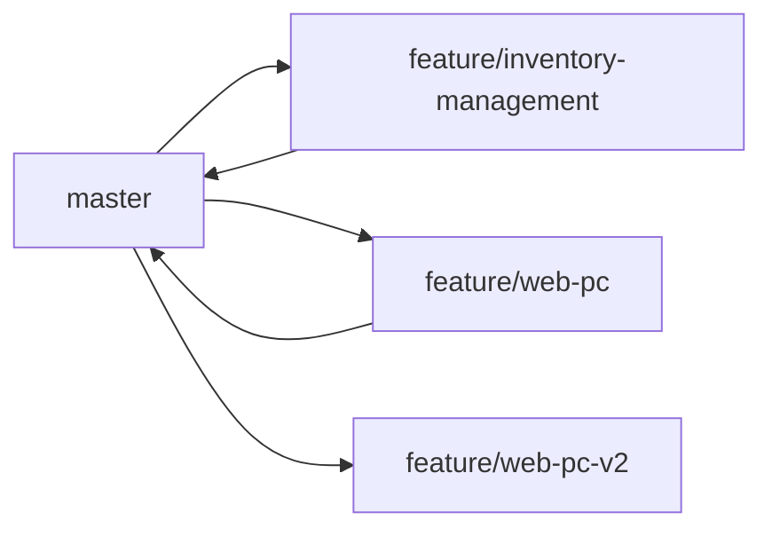

# Web 端（PC 管理后台）开发方案

> **⚠️ 本方案已废弃，被 `v6.3.0-Web端PC管理后台开发文档.md` 取代**
>
> 本文件为早期方案设计草稿，内容已过时。请移步新的完整开发文档：
> `doc/v6.3.0-Web端PC管理后台开发文档.md`

---

> 版本：v1.0（方案设计）
> 创建日期：2026-05-16
> 前置依赖：feature/inventory-management 合回 master 后启动开发

---

## 一、项目背景

爱养车 Plus 目前仅有微信小程序端，面向门店管理员/员工在手机上使用。Web 端旨在提供 PC 浏览器上的管理后台体验，满足：

- 门店管理员在电脑上查看报表/管理数据
- 批量操作（小程序不方便做的场景）
- 大屏数据看板
- 后续扩展给超级管理员做多门店管理

---

## 二、分支策略



| 阶段 | 操作 | 说明 |
|------|------|------|
| **当前** | `feature/web-pc` 已创建 | 方案设计阶段，尚未开始开发 |
| **第一阶段** | inventory-management 合回 master 后 | 启动 Web 端 MVP 开发 |
| **开发期** | 在 `feature/web-pc` 分支上开发 | 不影响 master 和其他分支 |
| **发布** | 开发完成 → 合回 master → 部署上线 | 与小程序同步发布 |

---

## 三、技术选型

### 推荐方案：Vue 3 + Element Plus

| 技术 | 选择 | 原因 |
|------|------|------|
| **框架** | Vue 3 (Composition API) | 语法接近小程序模板，学习成本低，社区活跃 |
| **UI 组件库** | Element Plus | 管理后台场景成熟，表格/表单/对话框/图表开箱即用 |
| **构建工具** | Vite | 快速冷启动，开发体验好 |
| **路由** | Vue Router 4 | Vue 官方路由 |
| **状态管理** | Pinia | Vue 3 官方推荐，比 Vuex 更简洁 |
| **HTTP 请求** | Axios | 封装云函数 HTTP 调用 |
| **图表** | ECharts | 报表/数据可视化场景 |
| **部署** | 腾讯云静态网站托管 | 低成本，支持 HTTPS |

### 备选方案对比

| 方案 | 优点 | 缺点 |
|------|------|------|
| **Vue 3 + Element Plus** | 组件丰富，开发快，学习成本低 | 暂无 |
| **React + Ant Design** | 生态更庞大 | 学习曲线稍陡，对小团队偏重 |
| **原生 HTML/CSS/JS** | 零依赖 | 复杂业务难以维护，不推荐 |

---

## 四、项目目录结构

```
aiyangche_plus/
├── miniprogram/              ← 小程序代码（不变）
├── cloudfunctions/           ← 云函数（不变）
├── web-admin/                ← 【新增】Web 端项目
│   ├── public/
│   ├── src/
│   │   ├── api/              ← 云函数 HTTP 调用封装
│   │   │   ├── request.js        ← Axios 实例 + 拦截器
│   │   │   ├── auth.js           ← 登录/权限相关 API
│   │   │   ├── report.js         ← 报表相关 API
│   │   │   ├── car.js            ← 车辆管理 API
│   │   │   └── order.js          ← 工单管理 API
│   │   ├── assets/           ← 静态资源
│   │   ├── components/       ← 公共组件
│   │   │   ├── AppLayout.vue     ← 后台布局（侧边栏+顶栏）
│   │   │   ├── PlateDisplay.vue  ← 车牌格式化显示
│   │   │   └── ProBadge.vue      ← Pro 版本标识
│   │   ├── composables/      ← 组合式函数
│   │   │   ├── useAuth.js        ← 登录态/权限管理
│   │   │   └── useCloudFunc.js   ← 云函数调用封装
│   │   ├── router/           ← 路由配置
│   │   │   └── index.js
│   │   ├── stores/           ← Pinia 状态管理
│   │   │   ├── user.js           ← 用户信息/权限
│   │   │   └── app.js            ← 全局状态
│   │   ├── utils/            ← 工具函数（从小程序复用）
│   │   │   ├── constants.js      ← 全局常量（同步小程序端）
│   │   │   ├── util.js           ← 纯工具函数
│   │   │   └── format.js         ← 格式化函数（金额/日期/车牌）
│   │   ├── views/            ← 页面
│   │   │   ├── login/            ← 登录页
│   │   │   │   └── LoginView.vue
│   │   │   ├── dashboard/        ← 首页看板
│   │   │   │   └── DashboardView.vue
│   │   │   ├── report/           ← 报表中心
│   │   │   │   ├── ReportView.vue
│   │   │   │   └── MonthlyReportView.vue
│   │   │   ├── car/              ← 车辆管理
│   │   │   │   ├── CarListView.vue
│   │   │   │   └── CarDetailView.vue
│   │   │   ├── order/            ← 工单管理
│   │   │   │   ├── OrderListView.vue
│   │   │   │   └── OrderDetailView.vue
│   │   │   ├── member/           ← 会员管理
│   │   │   │   └── MemberListView.vue
│   │   │   └── settings/         ← 设置
│   │   │       └── SettingsView.vue
│   │   ├── App.vue
│   │   └── main.js
│   ├── index.html
│   ├── vite.config.js
│   ├── package.json
│   └── .env.production          ← 生产环境变量
```

---

## 五、架构设计

### 5.1 云函数调用桥梁

Web 端无法使用 `wx.cloud.callFunction`，需要通过 HTTP HTTPS 调用微信云函数。

```
Web 端                   腾讯云 API 网关                  微信云函数
┌────────┐    POST      ┌──────────────┐    invoke    ┌──────────┐
│ Axios  │ ──────────►  │ tcb.invoke-  │ ──────────►  │ repair_  │
│ 请求   │              │ cloudfunction│              │ main     │
└────────┘              └──────────────┘              └──────────┘
```

#### 调用封装（src/api/request.js）

```javascript
// 基础请求封装，统一处理鉴权/错误
import axios from 'axios'
import { useUserStore } from '@/stores/user'

const request = axios.create({
  baseURL: 'https://api.weixin.qq.com/tcb',
  timeout: 15000
})

request.interceptors.request.use(config => {
  const store = useUserStore()
  // 注入 access_token（需提前获取）
  if (store.accessToken) {
    config.params = { ...config.params, access_token: store.accessToken }
  }
  return config
})
```

### 5.2 权限体系

复用小程序端已有的权限矩阵，Web 端做同等校验：

| 角色 | Web 端权限 |
|------|-----------|
| **管理员（admin）** | 全部功能 |
| **Pro 管理员** | 全部功能 + 报表/月报 |
| **非 Pro 管理员** | 报表仅"今日"tab，其余不可见 |
| **店员（staff）** | 不开放 Web 端（或仅限开单/查车） |

### 5.3 与小程序的代码复用

| 模块 | 复用方式 | 说明 |
|------|---------|------|
| `utils/constants.js` | **直接复制** | 纯 JS 常量，零依赖 |
| `utils/util.js` | **直接复制** | 纯工具函数，无 wx 依赖 |
| 月报规则引擎 | **直接复制** | `monthlyReportEngine.js` / `diagnosisRules.js` / `benchmarks.js` |
| 云函数 | **完全不动** | 已有 `repair_main` 云函数无需修改 |

---

## 六、首期功能范围（MVP）

### 6.1 必须功能

| 模块 | 页面 | 优先级 | 工作量评估 |
|------|------|--------|-----------|
| **登录** | 手机号+门店码登录 | P0 | 2 天 |
| **首页仪表盘** | 经营概况卡片 | P0 | 2 天 |
| **报表中心** | 经营报表（日/周/月/年） | P0 | 3 天 |
| **车辆管理** | 列表搜索 + 详情 | P0 | 2 天 |
| **工单管理** | 列表 + 详情 | P0 | 2 天 |

### 6.2 增强功能（MVP 后迭代）

| 模块 | 说明 | 优先级 |
|------|------|--------|
| **会员管理** | 列表搜索 + 详情 | P1 |
| **AI 月报** | 月度经营诊断报告 | P1 |
| **门店设置** | 基本信息修改 | P1 |
| **数据导出** | Excel 导出 | P2 |
| **大屏看板** | 实时经营数据大屏 | P2 |
| **批量导入** | 车辆/会员批量导入 | P2 |

---

## 七、开发计划

### 开发前提

> ⏳ **等待 `feature/inventory-management` 合回 `master` 后启动**

目前 `feature/inventory-management` 分支的库存管理功能尚未合并，为了避免后期冲突和双重维护，Web 端开发待其合回 master 后再正式开始。

### 预计工期

| 阶段 | 内容 | 预估工时 |
|------|------|---------|
| **环境搭建** | Vue 脚手架 + 目录结构 + Axios 封装 | 0.5 天 |
| **登录模块** | 登录页 + 权限校验 + 路由守卫 | 2 天 |
| **首页看板** | 经营数据卡片 + 快速入口 | 2 天 |
| **报表中心** | 日/周/月/年报表 + ECharts 图表 | 3 天 |
| **车辆管理** | 搜索列表 + 分页 + 详情 | 2 天 |
| **工单管理** | 列表 + 分页 + 详情 | 2 天 |
| **联调测试** | 全流程走通 + Bug 修复 | 2 天 |
| **部署上线** | 腾讯云静态网站托管 + 域名配置 | 1 天 |
| **总计** | **MVP 版本** | **~14.5 天** |

---

## 八、部署方案


| 方案 | 费用 | 国内访问速度 | 说明 |
|------|------|-------------|------|
| **腾讯云静态网站托管** | ~3 元/月 | ✅ 快 | 推荐，与微信云同生态 |
| **GitHub Pages** | 免费 | ❌ 慢 | 国内访问不稳定 |
| **自建 Nginx 服务器** | ~50 元/月 | ✅ 快 | 大材小用，不推荐 |

---

## 九、注意事项

1. **云函数无需修改**：小程序端已有的 `repair_main` 云函数完全兼容 HTTP 调用，Web 端只是换一种方式调同一套后端。
2. **登录鉴权**：Web 端需要获取微信 access_token 来调用云函数 HTTP 接口，这部分需要先在微信开放平台配置。
3. **响应式设计**：虽然叫做"Web 端"，建议至少适配 1280px 以上屏幕，后续可以考虑响应式适配平板。
4. **数据安全**：Web 端请求需做 CSRF 防护，敏感接口增加二次确认。
5. **版本同步**：Web 端和小程序端共用同一套云函数，发布时需注意前后兼容。

---

## 十、开发启动流程

当 `feature/inventory-management` 合回 master 后，执行以下命令启动开发：

```bash
# 1. 切到 master 拉取最新
git checkout master
git pull

# 2. 切到 web-pc 分支
git checkout feature/web-pc

# 3. 将 master 的最新代码合并过来
git merge master

# 4. 初始化 Vue 项目
npm create vue@latest web-admin

# 5. 安装依赖
cd web-admin
npm install element-plus echarts vue-router pinia axios
npm install -D @vitejs/plugin-vue

# 6. 开始开发
npm run dev
```
